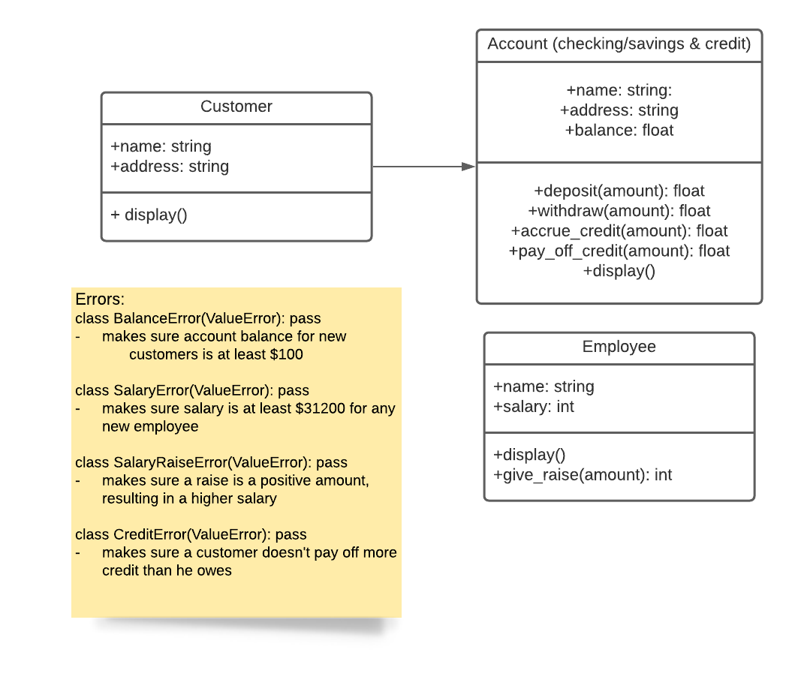

# Mini-Project 1: OOP in Python
In this assignment I create a couple classes and functions for a sample bank. Using standard libraries, I've created several classes with different getter, setter methods and custom functionality. Users can enter new customers, give accounts to those customers and hire new employees. A customer can withdraw or deposit money, pay off and accumulate credit. An employee can also receive a raise. A few custom errors are alos present that make sure a balance doesn't get too low, a salary raise is always positive, and employees make at least around $30,000 yearly.

# Using the script
Most of the functions are self-explanatory, following a standard naming convention. The print-outs that accompany various class methods will make it clear what they do.

# Note
The data will be stored as a list, until the appropriate function is run to export it to a JSON file. The data relationships are specified below.

For example:
emp = []
emp.append(Employee("Rita Johnson", 50000))
emp.append(Employee("Steven Gladwell", 45000))

The code above will create a list of employees. When the user is ready, he can save that list as a JSON file in a folder called Bank, which the script will create on its own, if not already present.

# Data Relationships and Errors

